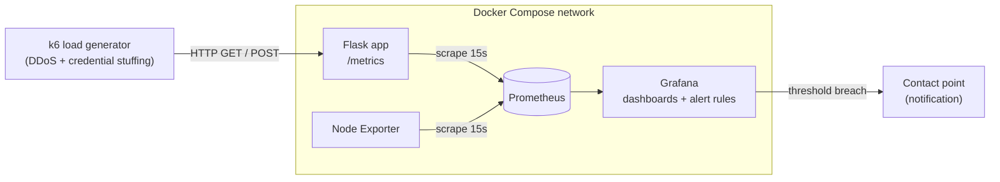

# Security Observability & Threat Detection Stack

A containerized security-observability pipeline that instruments an application, ingests its telemetry, and **detects two live attack scenarios in real time** — a volumetric DDoS-pattern flood and a credential-stuffing attack — using tuned PromQL detection rules. Attacks are generated with [k6](https://grafana.com/docs/k6/latest/), and detections are mapped to **MITRE ATT&CK** and **NIST CSF 2.0 / GLBA**.

> **Scenario note:** This lab was built as a WGU Cybersecurity capstone around a *fictional* fintech, "Hotline Capital Lending (HCL)." The company is invented; the stack, instrumentation, detection rules, and attack simulations are real and reproducible on any machine running Docker.

---

## Contents

- [Architecture](#architecture)
- [Threats detected](#threats-detected)
- [Detection rules](#detection-rules)
- [Instrumented metrics](#instrumented-metrics)
- [Tech stack](#tech-stack)
- [How to run](#how-to-run)
- [Validation & results](#validation--results)
- [Framework mapping](#framework-mapping)
- [Limitations & residual risks](#limitations--residual-risks)
- [Roadmap](#roadmap)
- [Repo structure](#repo-structure)
- [License](#license)

---

## Architecture

Four containers on a shared Docker Compose network. The instrumented app exposes a Prometheus `/metrics` endpoint; Prometheus scrapes it every 15s; Grafana visualizes the data and runs the alert rules; Node Exporter adds host-level metrics. k6 sits outside the stack and generates traffic.



## Threats detected

| Scenario | Description | MITRE ATT&CK |
|---|---|---|
| **Volumetric DDoS** | Application-layer HTTP flood targeting loan-application availability | [T1499.002 — Endpoint DoS: Service Exhaustion Flood](https://attack.mitre.org/techniques/T1499/002/) (related: [T1498 Network DoS](https://attack.mitre.org/techniques/T1498/)) |
| **Credential stuffing** | High-volume automated login attempts with invalid credentials against the auth endpoint | [T1110.004 — Brute Force: Credential Stuffing](https://attack.mitre.org/techniques/T1110/004/) |

## Detection rules

Detection is **rate-based and aggregate** — it flags anomalous volume rather than blocking individual requests, so legitimate users are never impacted. Thresholds below are the lab-calibrated values; see [Limitations](#limitations--residual-risks).

**DDoS traffic spike** — fires when sustained request rate crosses threshold:

```promql
sum(rate(http_requests_total{job="sample-app"}[1m])) > 0.5
```

**Credential stuffing** — fires when login attempts per minute cross threshold:

```promql
rate(login_attempts_total{job="sample-app"}[1m]) * 60 > 30
```

Supporting panel queries:

```promql
# P95 request latency
histogram_quantile(0.95, rate(http_request_duration_seconds_bucket[1m]))

# HTTP error rate
sum(rate(http_requests_total{job="sample-app", status=~"4..|5.."}[1m]))
```

> These are **Grafana-managed alert rules** — the expressions above are the live thresholds. Exporting the alert and dashboard JSON into a `grafana/` folder is a good next step to version them alongside the code.

## Instrumented metrics

The app emits three custom security metrics via the `prometheus_client` library:

| Metric | Type | Purpose |
|---|---|---|
| `http_requests_total` | Counter | Request volume / DDoS detection |
| `http_request_duration_seconds` | Histogram | Latency (P95) / performance impact |
| `login_attempts_total` | Counter | Credential-stuffing detection |

## Tech stack

| Layer | Tool |
|---|---|
| Orchestration | Docker Compose |
| Instrumented app | Python Flask + `prometheus_client` |
| Metrics store | Prometheus (15s scrape) |
| Visualization + alerting | Grafana |
| Host metrics | Node Exporter |
| Attack generation | k6 |

## How to run

**Prerequisites:** Docker + Docker Compose, and [k6](https://grafana.com/docs/k6/latest/set-up/install-k6/) for attack simulation.

```bash
# 1. Clone
git clone https://github.com/SkiGrimes/Security-observability-stack.git
cd Security-observability-stack

# 2. Bring up the stack
docker compose up -d

# 3. Confirm all containers are healthy
docker compose ps
```

Then open:

| Service | URL | Default login |
|---|---|---|
| Flask app | http://localhost:8000 | — |
| Prometheus | http://localhost:9090 | — |
| Grafana | http://localhost:3000 | `admin` / `admin` |

> Confirm ports against your `docker-compose.yml` before publishing.

**Attack simulation.** Two k6 profiles were used during validation (full details in the technical report):

- **DDoS:** ramp 50 → 200 virtual users over 3 min, repeated `GET` requests
- **Credential stuffing:** ramp 20 → 80 virtual users, `POST` to `/login` with randomized invalid credentials

Generate baseline traffic first so the counters and histograms populate, then run each profile and watch the Grafana dashboard.

## Validation & results

Detection was validated across three conditions: **pre-attack baseline → active attack → return to baseline**.

| Scenario | k6 generated | Detected on dashboard | Alert |
|---|---|---|---|
| DDoS | 37,409 requests, ~207 req/s peak (client-side) | Request-rate panel peaked near ~300 req/s | Fired |
| Credential stuffing | 14,390 login requests, 100% `401` | Login-attempts panel peaked ~8,000/min | Fired |

Instrumentation overhead was negligible — P95 latency held at ~4.75 ms throughout, including during attacks, and the four-container stack ran on a single workstation without contention. Every stage was captured during validation (see the technical report).

> **Interview-defensibility note:** the k6 client-side peak (~207 req/s) and the Grafana `rate()` panel peak (~300 req/s) differ because they measure different things (client throughput vs. server-side rate over the scrape window, with connection exhaustion dropping some client requests). Be ready to explain that distinction — it's a strength, not a discrepancy.

## Framework mapping

| Framework | Control | How this lab satisfies it |
|---|---|---|
| **NIST CSF 2.0** | `DE.CM` (Continuous Monitoring), `DE.AE` (Adverse Event Analysis) | Automated, continuous anomaly detection where none existed |
| **GLBA Safeguards Rule** | §314.4(h) | Continuous monitoring / periodic testing of key controls |
| **NIST SP 800-30** | Risk assessment | Threat scenarios selected via structured likelihood/impact rating |

Full mapping: [`docs/mitre-nist-mapping.md`](docs/mitre-nist-mapping.md)

## Limitations & residual risks

Called out honestly, because they matter in production:

- **Thresholds are calibrated on synthetic traffic**, not a real production baseline. The `0.5 req/s` and `30 attempts/min` values would need re-tuning against a 1–2 week production baseline to avoid false positives/negatives.
- **Single notification contact point** is a single point of failure. A production deploy should add a secondary channel (paging/SMS) alongside email.
- No log pipeline yet — this is metrics-only observability. Logs (e.g., Loki) would add investigation depth.

## Roadmap

- [ ] Export Grafana dashboard + alert-rule JSON into a `grafana/` folder for version control
- [ ] Add the k6 scripts under a `k6/` folder for full reproducibility
- [ ] Add validation screenshots and the technical report under `docs/`
- [ ] Add a third alert rule for P95 latency degradation (early warning before full outage)
- [ ] Add a secondary Grafana contact point to remove the notification SPOF
- [ ] Add log aggregation (Loki) for correlation alongside metrics

## Repo structure

```
Security-observability-stack/
├── README.md
├── LICENSE
├── .gitignore
├── docker-compose.yml
├── Dockerfile
├── requirements.txt
├── app.py               # Flask app entrypoint (instrumented)
├── app/                 # application package
├── prometheus.yml       # Prometheus scrape config
└── docs/
    └── mitre-nist-mapping.md
```

## License

Released under the [MIT License](LICENSE). Educational capstone project — the "Hotline Capital Lending" scenario is fictional.
